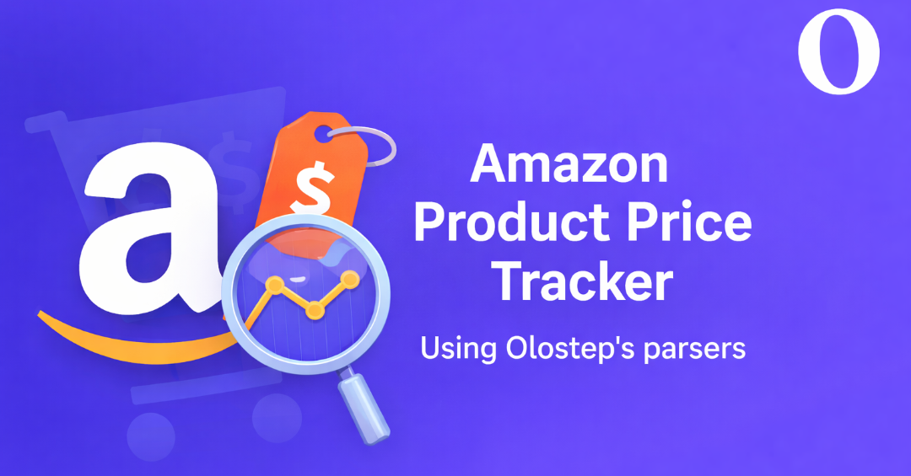

# Product Price Tracker

A modular price tracking app for product URLs using the OloStep scraper API.

[](https://docs.olostep.com/features/structured-content/parsers)

Learn more about parsers here: [OloStep Parsers Documentation](https://docs.olostep.com/features/structured-content/parsers).

It includes:
- A Streamlit dashboard (`app.py`)
- A one-shot CLI runner (`run_tracker.py`)
- A scheduled runner (`run_scheduler.py`)
- A modular codebase under `src/`
- Persistent outputs under `output/`

---

## Quick Links

- [Features](#features)
- [Project Structure](#project-structure)
- [Setup](#setup)
- [Parsers Documentation](https://docs.olostep.com/features/structured-content/parsers)
- [Run Streamlit App](#run-streamlit-app)
- [Run CLI Tracker](#run-cli-tracker)
- [Run Scheduler](#run-scheduler)
- [Outputs](#outputs)

---

## Features

- Scrapes product details from URLs in `data/product_urls.txt`
- Tracks latest price and previous price
- Detects price movement:
  - `higher`
  - `lower`
  - `same`
  - `new` / `unknown`
- Maintains CSV snapshot with product metadata
- Maintains JSON price history with fetch timestamps
- Computes average product price from JSON history
- Streamlit UI supports:
  - Add/Edit/Remove URLs
  - Manual tracking runs
  - Scheduler start/stop/status
  - Live metrics and product table

---

## Project Structure

```text
.
├── app.py
├── run_tracker.py
├── run_scheduler.py
├── assets/
│   └── thumbnail.png
├── data/
│   └── product_urls.txt
├── output/
│   ├── price_tracker_history.csv
│   └── product_price_history.json
└── src/
    └── tracker/
        ├── constants.py
        ├── csv_store.py
        ├── json_history.py
        ├── normalizer.py
        ├── olostep_client.py
        ├── scheduler.py
        ├── service.py
        ├── url_loader.py
        └── utils.py
```

---

## Setup

### 1. Install dependencies

```bash
pip install requests python-dotenv streamlit
```

### 2. Configure environment

Create/update `.env`:

```env
OLOSTEP_API_KEY=your_api_key_here
```

### 3. Add product URLs

Put one URL per line in `data/product_urls.txt`.

---

## Run Streamlit App

```bash
streamlit run app.py
```

In the app you can:
- Manage URLs (JSON view + add/edit/remove)
- Run tracking immediately
- Start/stop scheduler
- View tracked product table with average price from JSON

---

## Run CLI Tracker

One-time tracking run:

```bash
python run_tracker.py
```

Optional flags:

```bash
python run_tracker.py \
  --csv output/price_tracker_history.csv \
  --history-json output/product_price_history.json \
  --urls-file data/product_urls.txt \
  --sleep 2
```

---

## Run Scheduler

Run periodic comparisons from terminal:

```bash
python run_scheduler.py --interval-minutes 30
```

Optional flags:

```bash
python run_scheduler.py \
  --interval-minutes 15 \
  --csv output/price_tracker_history.csv \
  --history-json output/product_price_history.json \
  --urls-file data/product_urls.txt \
  --sleep 2
```

---

## Outputs

All outputs are written to `output/` by default.

### 1) CSV: `output/price_tracker_history.csv`

Contains latest tracked snapshot per product, including:
- `source_url`
- `scrape_status`
- `title`
- `price`
- `previous_price`
- `price_change`
- `price_change_direction`
- `currency`
- `review_stars`
- `number_reviews`
- `is_available`
- `seller_name`
- `seller_type`
- `image_url`
- `last_checked_at`

### 2) JSON History: `output/product_price_history.json`

Stores per-product timeline:
- Product metadata
- `price_history` list of `{ fetched_at, price }`
- Computed `average_price`
- Last seen price + timestamp

---

## Notes

- If CSV schema changes, it is auto-aligned by the app.
- New products are appended.
- Existing products are updated on successful scrapes.
- For successful updates, old `price` is shifted to `previous_price`.
