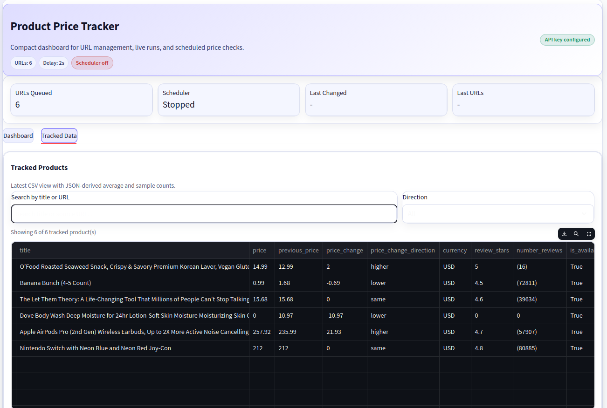

# Amazon Product Price Tracker (Python + Streamlit + Olostep API)

Track Amazon product prices with a lightweight Python workflow that scrapes product data via the **Olostep API**, stores history in **CSV + JSON**, and provides both a **Streamlit dashboard** and **CLI runners** for manual and scheduled checks.



## Why This Project

This project helps you:
- monitor Amazon product price changes over time
- compare current vs previous prices (`higher`, `lower`, `same`, `new`, `unknown`)
- run one-off checks from terminal or recurring checks on a schedule
- view a compact web dashboard for URL management, tracking controls, and filtered product data

## Features

- Streamlit dashboard (`app.py`)
  - add/edit/remove tracked URLs
  - run tracking manually
  - start/stop scheduler and view scheduler status
  - filter tracked products by title/URL and price direction
- CLI one-shot runner (`run_tracker.py`)
- CLI scheduler runner (`run_scheduler.py`)
- Auto-aligned CSV schema
- JSON history with average price and sample count

## Prerequisites

- Python 3.10+
- `pip`
- Valid `OLOSTEP_API_KEY`
- Internet access for API requests

## Quick Start

### 1) Install dependencies

```bash
pip install requests python-dotenv streamlit
```

### 2) Configure environment

Create `.env`:

```env
OLOSTEP_API_KEY=your_api_key_here
```

### 3) Add product URLs

Add one URL per line in:

```text
data/product_urls.txt
```

## Run the App

### Streamlit dashboard

```bash
streamlit run app.py
```

### CLI one-time tracking

```bash
python run_tracker.py
```

Optional flags:

```bash
python run_tracker.py \
  --csv output/price_tracker_history.csv \
  --history-json output/product_price_history.json \
  --urls-file data/product_urls.txt \
  --sleep 2
```

### CLI scheduled tracking

```bash
python run_scheduler.py --interval-minutes 30
```

Optional flags:

```bash
python run_scheduler.py \
  --interval-minutes 15 \
  --csv output/price_tracker_history.csv \
  --history-json output/product_price_history.json \
  --urls-file data/product_urls.txt \
  --sleep 2
```

## Output Files

All outputs are written to `output/` by default.

| File | Purpose |
|---|---|
| `output/price_tracker_history.csv` | Latest product snapshot including current/previous price and change direction |
| `output/product_price_history.json` | Per-product historical timeline with computed average price |

## Project Structure

```text
.
├── app.py
├── run_tracker.py
├── run_scheduler.py
├── assets/
│   ├── ui.png
│   └── thumbnail.png
├── data/
│   └── product_urls.txt
├── output/
│   ├── price_tracker_history.csv
│   └── product_price_history.json
└── src/
    └── tracker/
```

## Notes

- If CSV schema changes, it is auto-aligned by the app.
- New products are appended.
- Existing products are updated on successful scrapes.
- On successful updates, old `price` is shifted to `previous_price`.

## Olostep Parser Reference

- [Olostep Parsers Documentation](https://docs.olostep.com/features/structured-content/parsers)
- [Parser preview image](assets/thumbnail.png)
